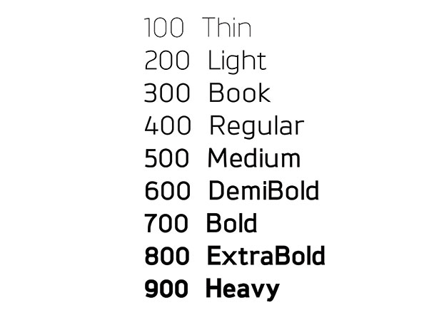
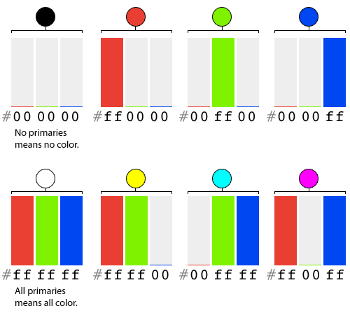
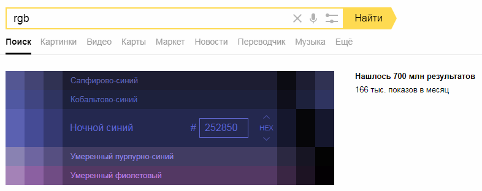
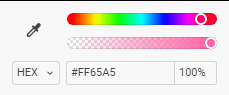
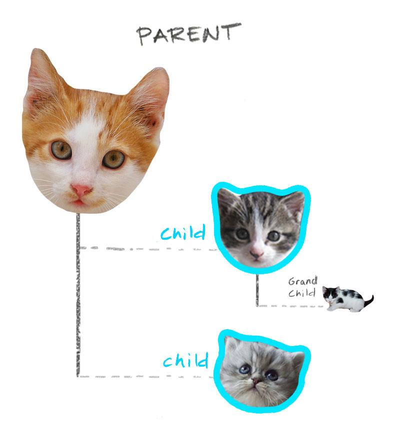

# 1.3. Оформление текстовых блоков с помощью CSS
## Что такое css и зачем он используется?

На предыдущих занятиях вы уже познакомились с разметкой html, которая является базой/структурой веб-страницы. Но дело в том, что html изначально предназначался для описания структуры контента страниц, а не для форматирования этого контента.

[http://info.cern.ch/hypertext/WWW/TheProject.html](http://info.cern.ch/hypertext/WWW/TheProject.html) – это первая в истории интернета страничка. И если бы не было css, именно так выглядели бы все страницы и сегодня. К счастью, это не так. :)

Действительно, разные теги выглядят по-разному, например, заголовки значительно больше параграфов, а ссылки имеют подчеркивание и синий цвет. Но возможностей тегов недостаточно для того, чтобы создать современно выглядящую страницу. Давайте представим, как мог бы выглядеть наш html, если бы мы взялись программировать все внешние характеристики отображения шрифта с помощью тегов: например, чтобы задать начертание (семейство) шрифта, можно было бы придумать тег `<sans-serif>`, который нужно было бы размещать вокруг фрагмента, которому мы бы хотели задать это свойство. Для задания красного цвета, к примеру, придумали бы тег `<red>`, для наклонного начертания – `<italic>`, и так нужно было бы по одному тегу на каждое возможное значение! Очевидно, что в этом случае наш html превратился бы в «монстра» с огромным количеством разных тегов, что значительно бы затруднило работу с ним. Только представьте – если в начале работы мы неверно выбрали цвет или начертание шрифта – пришлось бы вручную обойти весь проект и заменить одни теги на другие. Хорошо, что в настоящее время html для оформления не используется – хотя предпосылки к такому варианту развития были, однако разработчики вовремя остановились, и сейчас у нас есть CSS, который отвечает за все оформление, которое появляется на наших страницах.

> **CSS** – *Cascading Style Sheets* – каскадные таблицы стилей – это язык, содержащий набор информации, отвечающий за то, как именно будет отображаться страница сайта визуально: используя css, мы можем запрограммировать внешний вид страницы: оформление и расположение блоков и элементов. СSS поддерживается абсолютно всеми браузерами, и благодаря свой простоте, де-факто HTML+CSS стали стандартом для построения веб-интерфейсов.

## Где написать css?
Для подключения css используется два специальных тега `meta` и `style`.
Но так как мы будем работать с codepen, то эти теги использовать не будем. Стили пишем в окошко «css».

CSS правило:
```css
p {
  color: red;
}
```

В терминах CSS это – правило. Оно всегда состоит из:
* селектора (`p`) – указание, к  каким тегам применяются указанные в правиле стили;
* пар «свойство» – «значение», разделенных двоеточием и обязательно заканчивающихся точкой с запятой. Объявление правил заключается в фигурные скобки, которые показывают, где начинается и где заканчивается объявление правила.

## Что же может быть селектором?
В предыдущем примере это тег `p`, и наше правило применяется ко всем тегам `p` на странице.
То есть, чтобы обратиться к какому-то тегу, нужно просто указать его название в качестве селектора:

```css
h1 {
  color: red;
}
blockquote {
  color: red;
}
```

## Какие свойства можно записать внутри объявления правила?
### Базовые свойства для стилизации шрифта

Допустим мы хотим увеличить шрифт для заголовка `h2`. Для этого нам надо написать правило и в нем селектор по имени тега: `h2 { }`

Для того чтобы увеличить размер шрифта используется свойство **font-size**. Самый простой способ: задать размер шрифта в % от того размера который заголовок имеет сейчас, например:
```css
h2 {
  font-size: 120%;
}
```

Также мы можем указать размер шрифта другим способом – задать его в пикселях (px). Один пиксель равен одной точке на экране.
```css
h2 {
  font-size: 40px;
}
```

Что ещё мы можем сделать со шрифтом? Изменить жирность с помощью свойство **font-weight**. Значение можно указывать ключевыми словами (normal, blod) и в числах (от 100 до 900 с шагом в 100). Значение по умолчанию – `400`, что равно `normal`.


```css
h2 {
  font-weight: 700;
}
```

Можно изменить начертание с помощью свойства **font-style**. Значение `normal` это обычный шрифт, а значение `italic` сделает шрифт наклонным.
```css
h2 {
  font-style: italic;
}
```

С помощью свойства **font-family** можно изменить гарнитуру шрифта. Можно использовать универсальные названия семейств `serif` (с засечками), `sans-serif` (без засечек), `monospace` (моноширинный) . Также можно указать конкретное название шрифта:

```css
p {
  font-family: 'Times New Roman', serif;
}
```

Обратим внимание, что все эти свойства наследуются: если внутри нашего параграфа будет другой тег (например, ссылка `a`), то заданные нами свойства автоматически будут работать и для внутреннего тега тоже. Почему так происходит? Это определяется стандартами, и на самом деле это очень удобно – если бы не было этого механизма, нам бы пришлось следить за всеми тегами, которые вложены, и повторять все стили для них.

## Цвет текста и фона в CSS
Давайте вернёмся к первом правилу, где мы задали для всех параграфов красный цвет:

```css
p {
  color: red;
}
```

Здесь цвет задан ключевым словом «red». Всего таких слов 147. Как же быть, если нужно задать какой-то особенный цвет, для которого нет ключевого слова?
К нашим услугам несколько доступных вариантов задания цвета.


Для браузеров используется **RGB** модель цветовоспроизведения, где R, G, B - первые буквы основных цветов(красный, зеленый, синий) - и выбор именно этих цветов обусловлен особенностями цветовосприятия человеческого глаза. Согласно этой модели, любой цвет является результатом смешения основных цветов в разных пропорциях.

Как же мы можем представить цвет согласно этой модели, в числовом выражении?



Самым популярным способом является задание цвета с помощью 16-ричного кода(hex-формат).

В этом случае цвет записывается в виде 6-ти значного кода *#RRGGBB*, где *RR* означает интенсивность красного, *GG* - интенсивность зеленого, *BB* - интенсивность синего цвета, согласно модели RGB. Каждая из трех интенсивностей может принимать значения от 0 до 255, и записывается при помощи 2х значного 16-ричного кода.
Например: *color: #000000;* - черный цвет, *color: #ff00ff;* - цвет фуксии.


Также можно задать цвет в rgb-формате: воспользовавшись функцией **rgb(r, g, b)** где соответственно r, g и b - соответствующие интенсивности красного, зеленого и синего цветов.  
Например: *color: rgb(0,0,0);* - черный цвет, *color: rgb(255, 0, 255);* - цвет фуксии.  
Но это еще не все: мы можем задать полупрозрачный цвет, воспользовавшись функцией **rgba(r,g,b,a)**, где параметры r,g и b имеют точно такой же смысл, как и в функции rgb,  а последний, четвертый параметр “a” может принимать значения от 0 до 1 и означает степень непрозрачности цвета, где 0 - полная прозрачность, 1 - полная непрозрачность.   
*color: rgba(0,0,0,0.5)* - черный цвет, прозрачный наполовину
*color: rgba(255,0,255,0.2)* - цвет фуксии с 20%-ной непрозрачностью.

И не волнуйтесь — скорее всего, вам никогда не придётся высчитывать код цвета в уме. Код всегда можно найти:



Или определить в графическом редакторе с помощью инструмента «Пипетка»:



### Цвет фона
Используя все доступные нам цветовые форматы, мы можем менять не только цвет текста, но также и менять параметры фона.
Например, мы можем задать синий фон у блока так:

```css
h2 {
  background-color: lightyellow;
}
```

или так:

```css
p {
  background-color: #dbefbf;
}
```

## Комбинации селекторов (каскад/селекторы основанные на зависимостях)



В качестве селектора не обязательно может выступать одиночное название тега — чаще всего это комбинации тегов (каскад):
* `section p` — выберет все теги `p`, которые расположены внутри `section` (на любом уровне вложенности  —  “потомки всех уровней”  — дети, внуки, правнуки, и т.д.)
* `section>p` — выберет все теги `p`, которые расположены в первом уровне вложенности внутри `section` (дочерние селекторы, «потомки первого уровня» – только дети).

Также каскад часто используется для стилизации многоуровневых списков: но нужно быть осторожными – селектор `ul li` сработает на всех элементах `li`, даже на элементах вложеных списков, в то время как `ul>li` выберет также все элементы `li`, т.к. `li` всегда вложен в какой-то `ul`.
Немного более сложные комбинации:
`ul ul li` – выберет все элементы списков `li`, кроме самого верхнего уровня
`section p>a` – выберет все ссылки `a`, являющиеся детьми `p`, у которых, в свою очередь, есть `section`-родитель.

## Свойства для списков
Работая со списками, мы можем не только менять начертание шрифта и его размер. Можно использовать также специальные свойства для стилизации списков. Свойство **list-style-type** определяет тип маркера. 

Для маркированных списков доступны значения:
- *disc* - значение по умолчанию, заполненный кружок
- *circle* - “пустой” кружок
- *square* - квадратик

Для нумерованных:
- *decimal* - значение по умолчанию, арабские цифры
- *lower-roman* -  строчные римские цифры, например i , ii , iii и т.д.
- *upper-roman* - заглавные римские цифры, I, II , III и т.д.
- *lower-alpha* - строчные буквы латинского алфавита, a, b, c и т.д
- *upper-alpha* - заглавные буквы латинского алфавита A, B, C и т.д.
- *list-style-image* - свойство позволяет установить любую картинку в качестве символа маркера, например: list-style-image:url(‘marker.jpg’);
- *list-style-position* - позволяет указать положение маркера списка - outside для положения снаружи(является значением по умолчанию), inside - внутри.

## Решение задачи